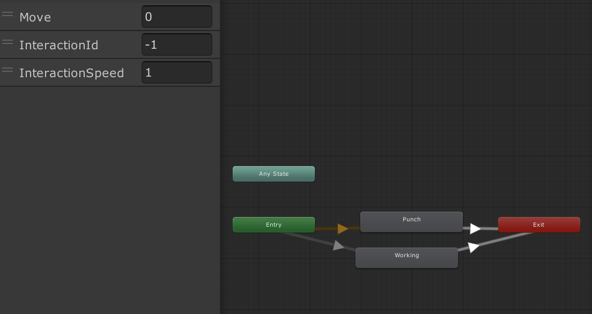
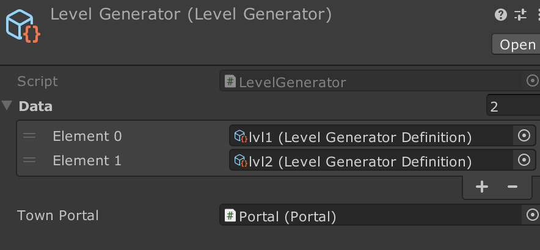

# Concepts

These explanations offer comprehensive insights into the underlying concepts. The systems are intentionally crafted with the assumption that documentation may not be necessary, but this space is available if you find any difficulty in grasping the concepts.

All systems are designed with simplicity, easy extensibility, and maximum isolation in mind, enabling independent use. The codebase has been meticulously constructed for clarity, ensuring that no component engages in unnecessarily complex calculations or enigmatic actions.

## Actors
The responsibility of moving characters, primarily the player, though other characters like workers can also utilize it, lies within this system. Components such as `HumanoidAnimationManager` are encompassed here. Additionally, it houses the `InputChannel` for facilitating communication between the UI (Joystick) and the game world (player character).

## Booting
The Booting scene contains a collection of GameObjects responsible for initializing the game. It awaits the loading of save data and potentially other types of initialization, such as SDK initializations or fetching remote config data through custom scripts. Subsequently, the `GameBooter` employs the `IntVariable` to retrieve the latest current level information, utilizing it to load a new level. When you initiate playback in the Editor (and during runtime), the Booting scene takes precedence, loading the scene based on an index derived from the current level variable.

## Data
Contains data types and tools to let you store high-level data like score, coin, collected resource count and so on. They can be stored using any `Saveable` class. 

### Save System
Arcade Idle Engine contains a lot of ScriptableObjects, some of them is just plain data holder but others have functionality as well. ScriptableObjects derived from Saveable contain implementation for saving data. These data can be saved and loaded from the disk. Initial value can be set if there isn't any save file. These `Saveable` objects can be saved by `SaveManager` class.

You need to assign Saveables to the `SaveManager` so it can save and load them when the game runs. Use SaveManager to save your game state like collected wood count or money.
Use `Tools > HypercasualPack > Open Save Directory` if you want to delete the save file or modify it manually.

> [!TIP]
> When working in Unity Editor, you might want to disable the `Save Automatically` bool in the `Automatic Save Load` GameObject inside the `Booting` scene in order to test things quickly. Otherwise, you would have to delete the save file and set the initial value for the `Current Level` variable to load the desired scene. If you want to learn more, head to the `Booting` section.

Saving tool list is more complex because it's needed to save their indexes. `UniqueIntListVariable` can be used to save their indexes. And then `GatheringToolDefinitionIndexLookup` can be used along with `GatheringToolDatabase` for indexing every gathering tool. 

You can also extend classes to create your own implementation by creating your own custom implementation that derives from `ObjectDatabase` and `IndexLookup` or `Saveable<T>`. Two concrete implementations can be found in the asset: `Int Variable` and `UniqueIntListVariable`.

> [!TIP]
> There is also a `SaveUpgrader` class that handles new save versions. It's usually required when you change the save data. If you need to learn more about this save versioning concept, you can find a lot of explanations on the internet.

## Economy
Utilizes [Data](#data) system to spend resources (coin, gem, wood). It can animate earning income via `ResourceAnimators`. It can let players spend resource via `ResourceSpender`.

## Gathering
Contains tools and gatherable sources which can be anything from trees to ores. You can get creative and invent interesting gathering mechanisms. Because essentially this system lets player produce an item if he has the right tools to gather. So one original idea might be a coffeemaker as a gathering tool and a sack full of coffee bean as a gatherable source. You grind and brew them and you get coffee cups.

For setting custom animations, you can create new state in the `Actor` animator and create a new transition from Entry to Exit with an equality check.

Then assign the `InteractionAnimationId` in the `GatheringToolType`.

## Interactables
Contains all the objects that can be interactable in the game world. It can be pop-up displayer, or a trigger that collects pickables from inventory when an inventory manager enters the area. 

## Inventory
This section deals with the inventory responsible for storing Pickables. It's designed straightforwardly, eliminating the need for an abstraction layer like an interface for communication. Other systems (e.g. `InventoryFeedingZone` and `InventoryCollectingZone`) directly interact with the `InventoryManager` to add, remove, or get the desired Pickables.

---

## Level Generation
The Level Generation system comprises components such as `LevelGenerator`, `LevelGeneratorDefinition`, `Group`, `Tile`, and `Portal`. Additionally, the `LevelGenerationTrigger` is included for initiating new level generation, provided as an example for customization. It's quite straightforward.

Each entry in the LevelGenerator represents a distinct world. You can have as many different levels as needed. When generating a new level, specify the desired level to create. In the example above, there are 2 levels.

{ width="800" height="300" style="display: block; margin: 0 auto" }

Each element in LevelGeneratorDefinition corresponds to the difficulty level. In the example above:

    Element 0 = difficulty 0
    Elemnt 1 = difficulty 1

If there's more than one entry inside the Group in the Element, a random one within that Group will be chosen. You can also specify a Group for the end of the level (e.g., a boss), and which tile to use when spawning all the groups.

## Monitors
These are basic objects that visually represent data, usually through a text object within a Canvas. They actively listen for changes in the variables they are monitoring and automatically update their displayed values accordingly.

## Pickables
If something can be picked up, it can be turned into a `Pickable`. To mark an object as pickable, just add a Pickable component to it; think of it like a tag.

There's a significant part called `PickableDefinition`, which includes details like whether the picked item should be visible, if it can be sold, and its image for the UI. Many other systems need this Pickable type.

## Pools
These are generic implementations of pools. It's crucial to use them instead of frequently using Instantiate and Destroy because doing so would put unnecessary strain on the CPU and memory, resulting in additional garbage in the memory.

## Processors
These are kind of like a machines which processes Pickables. Process can do [selling](#sellers), [spawning](#spawners), or [transforming](#transformers).

### Sellers
It sells desired pickables by using their sell value and sellable properties. There are 2 kinds of Sellers. One is `PickableSellerFloatingText` and the other is `PickableSellerFloatingImage`

Some `IntVariable` are treated with extra stuff and they are called `Resource`. These are things like coin, money, wood or so on. You can use `ResourceAnimator` along with the `ResourceTargetImage` to create animated image effect when resource changes. You also need to make sure that the GameObject has the IntVariableMonitor.

### Spawners
`PickableSourceSpawner` spawns Pickables using a pool. It can be then collected by a GameObject that has `InventoryManager` component.

### Transformers
The script defines a class that is responsible for collecting, modifying, and stockpiling pickable items according to specified rules and timers. This class manages the transition of items between unmodified and modified states, with the modification process influenced by an upgradeable work speed. It utilizes coroutines and timers to manage item collection and processing.

> [!WARNING]
> Ensure that the number of text fields in `PickableTransformerMultipleCondition` matches the number of input fields in the `MultipleConditionRuleset`. If they do not match, an error will be printed out in the console.

---

## Tween Feedbacks
Simple scripts that allows you to define any custom feedback effects. You can create new feedback effects by changing the properties, or implementing new behaviours by deriving from `TweenFeedback`. It's mostly used in [gathering](#gathering), when chopping trees for example.

---

## Workers
Workers can be spawned using `WorkerManager`. You can controll all the workers who has been spawned from the same manager. In the asset, you can see two most common features, pausing and resuming all the workers.

There are two different versions of workers, one has the extra `PickableGatherer` so they can gather gatherables. Create new worker prefabs and assign them to the WorkerManager's so you can spawn and control them.